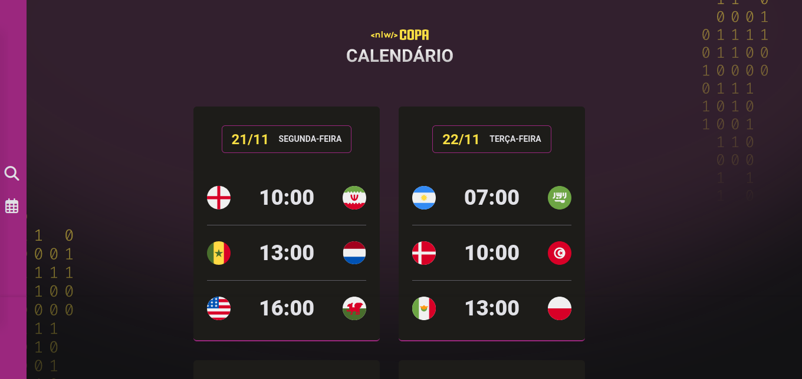

<h1 align="center"> Calendário de Jogos da Copa - NLW </h1>

Evento exclusivo e gratuito, promovido pela Rocketseat para ensino de tecnologias WEB.

  <a href="#-tecnologias">Tecnologias</a>&nbsp;&nbsp;&nbsp;|&nbsp;&nbsp;&nbsp;
  <a href="#-projeto">Projeto</a>

  

## 🚀 Tecnologias

Esse projeto foi desenvolvido com as seguintes tecnologias:

- HTML e CSS
- JavaScript e JSON

## 💻 Projeto

Next Level Week Copa é um projeto voltado para o desenvolvimento de um site que apresenta o calendário de jogos da Copa do Mundo 2022.

---

Feito com ♥ by mayarans
